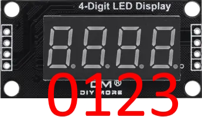

# EndTM1637
Библиотека для 7-сегментного дисплея на TM1637 с десятичными точками

- Вывод int
- Вывод float с автоматическим и ручным определением кол-ва символов после запятой
- Вывод массива (2 - 4 символа) с расположением справа, слева или по центру
- Вывод отдельного символа
- Вывод 4 символов вручную
- Вывод бегущей строки
- Включение / выключение точек
- Регулировка яркости (0 - 7), возможность выключить дисплей
- Очистка дисплея

## Содержание
- [Установка](#insl)
- [Инициализация](#init)
- [Использование](#use)
- [Пример](#exp)
- [Версии](#ver)

<a id="insl"></a>
## Установка
- Скачать архив и установить данными способами:
  - Распаковать и положить в C:\Program Files (x86)\Arduino\libraries (Windows x64)
  - Распаковать и положить в C:\Program Files\Arduino\libraries (Windows x32)
  - Распаковать и положить в Документы/Arduino/libraries/
  - (Arduino IDE) автоматическая установка из .zip: Скетч/Подключить библиотеку/Добавить .ZIP библиотеку… и указать скачанный архив

<a id="init"></a>
## Инициализация
```cpp
EndTM1637 disp(byte ClK, byte DiO)  //Указываются пины CLK и DIO
```

<a id="use"></a>
## Использование
```cpp
void setBright(byte brightness, bool on);  //Яркость 0 - 7(по умолч. 7), подстветка включена - 1 или 0(по умолч. 1)
void setBytes(byte byte1, byte byte2, byte byte3, byte byte4);  //Вывод 4 символов вручную(см. список символов в EndTM1637.h)
void clear();  //Очистка дисплея
void dots(int numpoint, bool stat);  //Точки; номер индикатора 0 - 3(если -1 то все точки погаснут), состояние точки 0 или 1(по умолч. 1)
void displayInts(int numberhi, bool nulles, byte dotes);  //Вывод int; аргументы: число int(numberhi), нули слева(1 - вкл, по умолч. 0 - выкл), точки(не используется, вспомогательный аргумент для вывода float)
void autoFloat(float data);  //Авто-вывод float; функция выводит float(data) так, чтобы оно заняло весь дисплей
void manualFloat(float num, byte droby, bool nulls);  //Вывод float вручную; доп. указывается кол-во знаков после запятой, возможность вывести нули слева как в displayInts
void runningString(uint8_t *str, uint8_t size, uint16_t ms);  //Бегущая строка; аргументы: си-строка, размер строки, время в мс между движениями символов
void setArray(uint8_t *str, uint8_t size, byte stor);  //Вывод массива; аргументы: си-строка, размер строки, выравнивание слева, справа или по центру(_LEFT(по умолч.), _RIGHT, _MIDDLE)
void setByte(byte byt, byte pos);  //Вывод символа; аргументы: символ(список см. в EndTM1637.h), номер индикатора
```

### Особенности
- Выше часто упоминается "номер индикатора", в данном случае надо представить дисплей как массив из 4 байт данных. А в массиве левый элемент это 0, как и на дисплее, 
значит номера индикаторов на дисплее будут выглядить так:



- В списке символов есть _last и _dot. Если в setBytes, setArray или setByte ввести _last, то индикатор на дисплее не будет изменен(_last хранит последнее значение индикатора).
  А если ввести _dot, то на индикаторе будет гореть только точка.
- Свои символы можно создавать по такой схеме:
```cpp
  //      A
  //     ---
  //  F |   | B
  //     -G-
  //  E |   | C
  //     ---
  //      D   X
  //  XGFEDCBA
  //0b00111111  // 0
  //где 0 - сенмент выключен, а 1 - сегмент включен
```
- **!!!ВАЖНО!!!** Байт не должен быть равен 0b00000100, так как это значение занято дефайном _last! Символ дисплея не будет изменен!
- В setArray для разных длин массива доступно разное кол-во позиций на дисплее, всего их 3(справа - _RIGHT, слева - _LEFT и по центру - _MIDDLE).
  Для массива из 2 символов доступно 3 позиции(справа, слева и по центру), для массива из 3 символов доступно уже 2 позиции(справа и слева),
  а для 4 символов доступно только 1 положение и оно не зависит от введенной в функцию константы.
  
<a id="exp"></a>
## Пример
- Данный пример есть в библиотеке
```cpp
#include <EndTM1637.h>
EndTM1637 disp(2, 3);	//Обозначаем пины (CLK, DIO)

void setup() {
  disp.setBright(7, 1);	//Устанавливаем яркость(0 - 7), подсветка включена(по умолчанию)
  //Вообще при создании объекта яркость 7 и подсветка включена
}

void loop() {
  disp.clear();	//Очистка дисплея
  disp.setBytes(_empty, _empty, _h, _i);	//Вывод "по байтам", первые два места пустые, вторые заняты буквами h и i(список можно найти в EndTM1637.h в папке библиотеки)
  delay(2000);	//Ждем
  disp.setBytes(_1, _2, _last, _r);	//Первые два места это цыфры 1 и 2, третье место это последний установленный в него символ(тот что горит на дисплее), четвертое место это r
  delay(2000);	//Ждем
  disp.clear();	//Очистка
  disp.displayInts(28);	//Вывод целого числа
  delay(2000);	//Ждем
  disp.clear();	//Очистка
  disp.displayInts(28, true); // Вывод числа, второй аргумент это нули(оставшиеся пустые места занять нулями)
  delay(2000);	//Ждем
  disp.clear();	//Очистка
  disp.autoFloat(12.8);	//Авто-флоат, вывод числа с точкой так, чтобы оно заняло весь дисплей
  delay(2000);	//Ждем
  disp.clear();	//Очистка
  disp.manualFloat(12.83, 2);	//Ручной вывод числа с запятой, сначало число, затем кол-во знаков после запятой
  delay(2000);	//Ждем
  disp.clear();	//Очистка
  disp.manualFloat(12.83, 1);	//Ручной вывод флоат, теперь с 1 знаком после запятой
  delay(2000);	//Ждем
  disp.clear();	//Очистка
  disp.manualFloat(12.83, 1, true);	//Ручной вывод флоат, первый аргумент - число, второй - кол-во занков после запятой, третий - нули(как в displayInts)
  delay(2000);	//Ждем
  disp.clear();	//Очистка
  byte rs[14] = {_r, _u, _n, _n, _i, _n, _G, _empty, _S, _t, _r, _i, _n, _G}; //Готовим строку для вывода
  disp.runningString(rs, sizeof(rs), 300);	//Вывод бегущей строки, первый аргумент - си-строка, второй - размер строки, третий - задержка между движением символов(мс), после движения строки дисплей очищается
  delay(2000);	//Ждем
  disp.displayInts(12);	//Вывод целого числа
  disp.setBytes(_U, _dot, _last, _last);	//Вывод "по байтам", первый символ U, второй это точка, третий и четвертый - без изменений(число 12)
  delay(2000);	//Ждем
  disp.dots(-1);	//Точки, значение "-1" - выключение всех точек
  delay(2000);	//Ждем
  disp.dots(0);	//Точки, первый аргумент - номер символа, второй - состояние(0 или 1), по умолчанию точка включается
  delay(2000);	//Ждем
  disp.dots(1);	//Точки, включаем точку в символе 1
  delay(2000);	//Ждем
  disp.dots(2);	//Точки, включаем точку в символе 2
  delay(2000);	//Ждем
  disp.dots(3);	//Точки, включаем точку в символе 3
  delay(2000);	//Ждем
  disp.dots(0, 0);	//Точки, выключаем точку в символе 0
  delay(2000);	//Ждем
  disp.dots(1, 0);	//Точки, выключаем точку в символе 1
  delay(2000);	//Ждем
  disp.dots(2, 0);	//Точки, выключаем точку в символе 2
  delay(2000);	//Ждем
  disp.dots(3, 0);	//Точки, выключаем точку в символе 3
  delay(2000);	//Ждем
  disp.clear();	//Очистка
  byte str1[2] = {_S, _U};	//Подготовка массива для вывода(2 символа)
  disp.setArray(str1, sizeof(str1));	//Вывод массива, первый аргумент - массив, второй - размер массива, третий - расположение массива(по умолчанию - слева, _LEFT)
  delay(2000);	//Ждем
  disp.clear();	//Очистка
  disp.setArray(str1, sizeof(str1), _RIGHT); // Вывод массива, теперь расположение - справа
  delay(2000);	//Ждем
  disp.clear();	//Очистка
  disp.setArray(str1, sizeof(str1), _MIDDLE);	// Вывод массива, теперь расположение - центр
  delay(2000);	//Ждем
  disp.clear();	//Очистка
  byte str2[3] = {_S, _U, _r};	//Подготовка массива(3 символа)
  disp.setArray(str2, sizeof(str2)); //Вывод массива, по умолчанию - слева, для 2 символов доступно три расположеия(слева, справа, центр), для 3 символов доступно 2 положения - слева и справа
  delay(2000);	//Ждем
  disp.clear();	//Очистка
  disp.setArray(str2, sizeof(str2), _RIGHT);	// Вывод массива, теперь расположение - справа
  delay(2000);	//Ждем
  disp.clear();	//Очистка
  byte str3[4] = {_S, _U, _r, _E};	//Подготовка массива, 4 символа
  disp.setArray(str3, sizeof(str3));	//Вывод массива, для 4 символов доступно одно положение и оно не зависит от третьего аргумента
  delay(2000);	//Ждем
  disp.setByte(_C, 0);	//Вывод символа, первый аргумент - символ, второй - расположение(номер символа)
  delay(2000);	//Ждем
  disp.setByte(_A, 3);	//Вывод символа, теперь буква A, в символе 3(крайнем правом)
  delay(2000);	//Ждем
}
```

<a id="ver"></a>
## Версии
- v1.0
